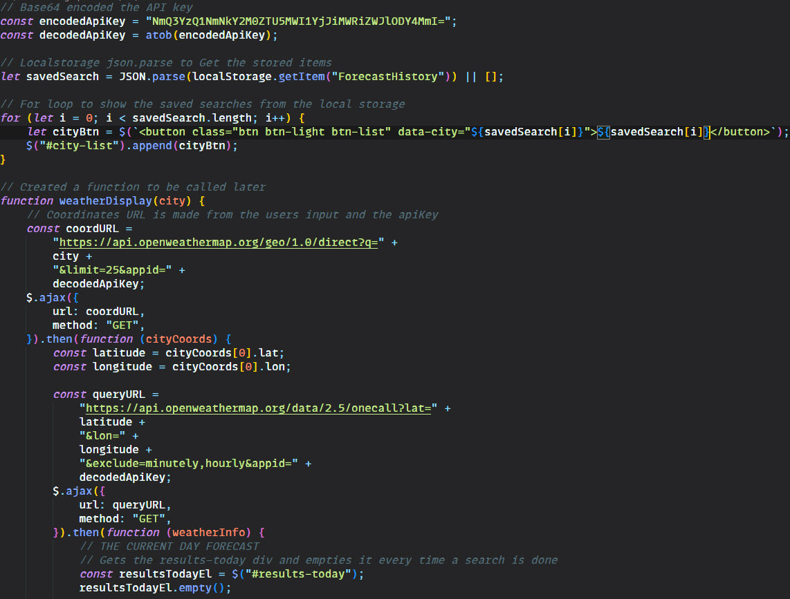

# Weather Dashboard
## Description
In this weeks bootcamp challenge, I was asked to create a Weather Dashboard retriving data from the [5 Day Weather Forecast](https://openweathermap.org/forecast5) API and using it to build aan app that will run in the browser and feature dynamically updated HTML and CSS.
## Acceptance Criteria

My application had to satisfy the following criteria:

```
* Create a weather dashboard with form inputs.
  * When a user searches for a city they are presented with current and future conditions for that city and that city is added to the search history
  * When a user views the current weather conditions for that city they are presented with:
    * The city name
    * The date
    * An icon representation of weather conditions
    * The temperature
    * The humidity
    * The wind speed
  * When a user view future weather conditions for that city they are presented with a 5-day forecast that displays:
    * The date
    * An icon representation of weather conditions
    * The temperature
    * The humidity
  * When a user click on a city in the search history they are again presented with current and future conditions for that city
```

## Learning Points
This weeks challenge was great fun, I am familiar with working with API's and so I knew the basics of how they worked. Getting the co-ordinates of the user's city and then storing them to call the forcast API was a good challenge. 
Also using local storage again to store the previously searched cities was as always a challenge, but one I managed to over come after a fair few hours of trying various tricks.

I spent a little extra time on my CSS this week and I'm happy with the overall result.

## Useful Information
The page is deployed on GitHub - [Click here](https://rbrd87.github.io/weather-dashboard)

The repository of the project is also hosted on GitHub - [Click here](https://github.com/rbrd87/weather-dashboard)

## Demo / Screenshots
Here is a demonstration of my code quiz


And here is a small snippet of my code


## Credits 

The cloud background is provided by [loading.io](https://loading.io/background)/